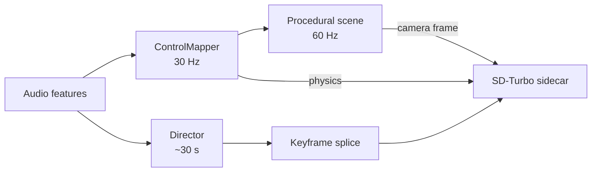
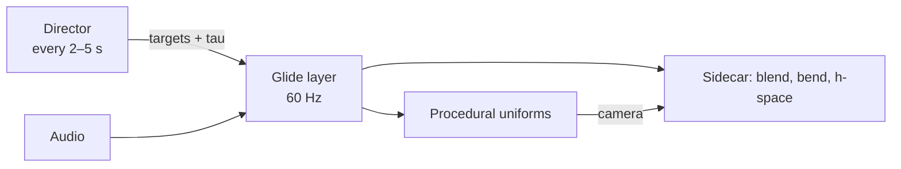

# Live knob direction

As of 2026-09-24. Prototype built; validation results recorded below.

## Summary

Proposal: the director stops emitting a whole new scene every ~24–30 s and
instead continuously steers knobs inside the running model. The knobs are
prompt blend weights, procedural scene uniforms, Bender gains and h-space
direction strengths. The procedural shader already feeds the sidecar a fresh
camera frame every step, so the keyframe's grounding job (ADR-004) may already
be covered. The first experiment is to switch keyframes off and measure drift
and jitter.

## Current state

The visible ~24 s change is a keyframe splice, not per-frame generation. Audio
already turns knobs at 30 Hz through `ControlMapper`.

| Trigger | Where | Cadence |
| --- | --- | --- |
| Director picks a new scene (prompt + look) | `Director`, `sceneFromPlan` | Section boundary, at most every 30 s |
| Reseed, same prompt, new seed | `CheckpointScheduler` | Every 16 bars (~30 s at 128 bpm) |
| Stagnation reseed | `CheckpointScheduler` | After 8 s of low change |
| Keyframe paint-in | `tools/stream-server.py` | 4 steps batched with live frames, faded in over 1–2 bars |

The keyframe was added because a loop fed only its own output collapses to an
attractor within ~90 frames (ADR-004). `src/core.ts` now feeds the procedural
scene to the sidecar every frame, which is a fresh external input on each step.

### Validation result

The controlled run used 4,800 frames for the keyframe baseline and the
keyframe-off arm, plus an 800-frame A-to-B ramp. The off arm stayed semantically
stable: CLIP margin slope -0.0017/min and on-prompt share 1.000, compared with
-0.0378/min and 0.743 for the baseline. Structural correlation, jitter, and
drift were not worse off. This supports treating checkpoints as content
renewal while the procedural source provides grounding.

The single A-to-B ramp did not produce a clean B crossover: its preference swing
was only 0.0897 and the interior curve remained mostly A-favouring. This is
inconclusive, not evidence of a smooth morph. Multiple prompt pairs spanning
semantic distance are still required before choosing a knob-only default.

The h-space sweep also failed its directional sanity check, so h-space remains
experimental and opt-in.

## Research

Prior work backs continuous in-model control over periodic regeneration. The
cheapest options need no training.

| Technique | What it controls | Cost on 6 GB | Fit |
| --- | --- | --- | --- |
| [Network bending](https://arxiv.org/abs/2406.19589) (Dzwonczyk et al., DAFx 2024) | Point-wise, tensor-wise and morphological ops inside UNet layers, driven by RMS, centroid, flux | ~0, already have `Bender` | High |
| [Prompt-embedding interpolation](https://github.com/rosamundLL/live-diffusion-bending) (live StreamDiffusion bending) | Gradual scene travel instead of frame crossfades | One text encode per prompt | High |
| [StreamDiffusionTD](https://dotsimulate.com/docs/streamdiffusiontd/parameters) prompt blending | Several weighted prompts, changed live | Same as above | High |
| [h-space directions](https://ar5iv.labs.arxiv.org/html/2210.10960) (Asyrp) | Add a vector at the UNet bottleneck; linear and consistent across timesteps | One add per frame | Medium-high |
| [Unsupervised h-space directions](https://arxiv.org/pdf/2310.09912) | Discover directions without labels | Offline precompute | Medium |
| [Concept Sliders](https://sliders.baulab.info/) | LoRA knobs per concept | Training + VRAM | Later |
| [FreeSliders](https://arxiv.org/pdf/2511.00103) | Training-free slider variant | Extra passes | Investigate |
| [Real-Time AttentionBender](https://arxiv.org/pdf/2606.06497) | Bending attention and FFN in video DiTs | Wan-scale, too big | Reference only |

The network bending paper states the approach "allows for continuous,
fine-grain control of image generation". Asyrp shows that interpolating in
h-space gives gradual change, including at unseen intensities.

## Proposed design

The director sends knob targets plus a time constant every few seconds. A
30–60 Hz layer glides toward them, and audio adds fast motion on top.

| Knob channel | Director sets | Fast layer does | Where it lands |
| --- | --- | --- | --- |
| Prompt blend | 3–4 anchor prompts per section + target weights | Slerp weights toward target | Sidecar embedding lerp (`stream-server.py:510`) |
| Procedural look | Targets for hue, warp, organic, swirl | Ease toward targets; audio modulates | `ProceduralScene` uniforms |
| Bender | Gain per operator | Audio drives the operator amount × gain | `Bender.set` |
| h-space directions | Strength per mood axis (energy, darkness, organic vs geometric) | Ease toward target | New bottleneck hook in UNet |
| Mapper gains | How strongly each audio feature drives each knob | Unchanged 30 Hz mapping | `ControlMapper` |
| Hard cut | Rare: genre change or a very high cut probability | Keyframe splice as today | `CheckpointScheduler` |

The director should not make fresh decisions every frame: decisions built from
a few frames of features jitter. It stays the judgment layer (ADR-009) and the
mapper keeps the fast motion. h-space directions are built without training,
from the average bottleneck difference between prompt pairs.

## Experiment plan

The first test is whether the procedural camera alone keeps the loop grounded
with keyframes off.

1. Add a switch that disables `CheckpointScheduler` splices (hard cuts included).
2. Run `node scripts/stream-smoke.mjs` for 5+ minutes of music with procedural
   input on. Repeat with keyframes on as the baseline.
3. Log the sidecar's `drift`, `change` and `jitter` from the 5 s `_telemetry`
   records.
4. Repeat with a prompt blend walking between two anchors, to check that
   embedding travel alone produces visible scene change.

Pass criteria:

- `drift` stays within the keyframe baseline's range for the whole run, with no
  attractor patterns.
- `jitter` is no worse than baseline.
- A prompt-blend transition reads as a scene change within about 2 bars.

If drift grows, keep low-rate reseeds as a safety net and put the knobs on top.

## Implementation steps

Build in order. Each step is testable on its own.

- [x] Keyframe off switch, then run the drift/jitter experiment above
- [x] Protocol: a `blend` control message with prompts, weights and a time
      constant; the sidecar caches embeddings and slerps
- [x] Director output: a `KnobTargets` type (blend, look, bender gains, mapper
      gains) in place of `Scene` for non-cut decisions
- [x] Glide layer in the browser that eases toward targets and merges with
      `ControlMapper` output
- [!] h-space hook: precompute direction vectors from prompt pairs; add
      strength × vector at the UNet mid block
- [x] Record the decision in `docs/decisions.md` as a new ADR

## Open questions

- Should hard cuts keep using keyframe splices, or should everything go through
  knobs?
- Does embedding travel alone move content enough at the current `strength`, or
  does structure stay locked to the procedural camera?
- Should the director also drive procedural geometry (shape families), so
  structure changes as well as style?
- Does the local System One run cheaply enough for a 2–5 s cadence? Jev is off
  the table under the local-only rule.
- Does the h-space hook break the CUDA graph capture (ADR-007)? Direction
  strengths must be tensors updated in place.

## Sources

Pages opened and read:

- [live-diffusion-bending (GitHub)](https://github.com/rosamundLL/live-diffusion-bending)
- [Real-Time AttentionBender (arXiv 2606.06497)](https://arxiv.org/abs/2606.06497)

Found through search, summaries only (not yet read in full):

- [Network Bending of Diffusion Models for Audio-Visual Generation (arXiv 2406.19589)](https://arxiv.org/abs/2406.19589)
- [Diffusion Models Already Have a Semantic Latent Space (Asyrp)](https://ar5iv.labs.arxiv.org/html/2210.10960)
- [Unsupervised Discovery of Interpretable Directions in h-space](https://arxiv.org/pdf/2310.09912)
- [Concept Sliders](https://sliders.baulab.info/)
- [FreeSliders](https://arxiv.org/pdf/2511.00103)
- [StreamDiffusionTD parameters](https://dotsimulate.com/docs/streamdiffusiontd/parameters)

In this repo: `docs/architecture.md`, `docs/decisions.md` (ADR-004, 007, 009),
`src/core.ts`, `tools/stream-server.py`.
